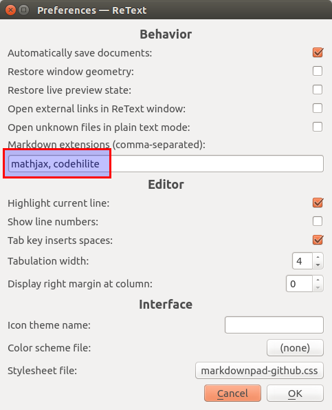

[**GitHubBlog**](https://github.com/bbxytl/bbxytl.github.com/tree/master/blog#home--githubblog) /
=====
#[**给Retext进行配置：语法高亮、数学公式、自定义样式**](https://github.com/bbxytl/bbxytl.github.com/blob/master/blog/pages/150004_给Retext进行配置.md#githubblog-)
----

由于转到了Ubuntu下，本来在Windows平台下使用的一直是MarkdownPro2，而且进行了破解，十分好用。转到Ubuntu下后，MarkdownPro2不能够使用了，找了下Linux平台中的ReText算是比较好用的（也测试了一下CuteMarkEd，但感觉不如ReText）。只是，刚安装好的ReText是不算好用的，这里记录一下我的配置路：

- 添加中文输入支持
- 添加自定义CSS
- 添加数学公式支持
- 添加语法高亮

##1. 添加中文输入支持
- 这个在上一篇博文中已经解决掉了，主要是因为我用的输入法是搜狗（fcitx），具体解决方案参照：[Ubuntu下Qt（Retex）无法输入中文](./3_Ubuntu下Qt（Retex）无法输入中文.md#githubblog-)

##2. 添加自定义CSS
- 在网上找了一段时间，没找到，我其实是希望使用github的markdownCSS，但没找到，突然想起我在Windows平台下使用的MarkDownPro2里貌似有这个CSS，于是果断找到markdownPro2的css存放目录：
` c:\用户\我的用户名\AppData\Roaming\MarkdownPad2\styles`
- 果然在里面看到这几个出现在markdownPro2设置界面里的Css：

```
markdown.css
markdownpad-github.css
none.css
solarized-dark.css
solarized-light.css
```
- 果断Copy跑到Ubuntu里！然后打开ReText的设置界面，在“StyleSheet File” 选项选择刚才存放在Ubuntu里的css文件，我选择的是github的那一个，重启ReText，输入内容，预览测试一下，OK！

##3. 添加数学公式
- 有时候需要在文档中添加一些数学公式，比如时间复杂度什么的$O(N^2)$，其实，我发现Github官网的页面是不支持的，不知道是不是Github有自己的数学公式输入格式。
- 在Retext下想使用，首先应该先安装**MathJax**
```shell
sudo apt-get install libjs-mathjax
```
- 安装好后，打开ReText的设置界面，在**Markdown extensions**框里添加字段：**mathjax**，重启ReText，输入公式，如 $N_3^2$ ，OK！
- ReText官网给出了方法：[给ReText添加数学公式支持](http://sourceforge.net/p/retext/wiki/MathJax/)

##4. 添加语法高亮
- ReText支持语法高亮，但需要在在**Markdown extensions**框里添加字段：**codehilite**，同时，需要下载安装高亮支持模块**python-pygments**：

```shell
sudo apt-get install python-pygments
```
- 这个方法来自与[ReText的扩展说明](https://pythonhosted.org/Markdown/extensions/)
文档里的扩展功能添加进ReText的**Markdown extensions**时，都必须该成小写字母，否则无效！同时，两个扩展之间用英文逗号分割。
- 我的设置：     
    


##**附录**
- **[GitHub-Blog](http://bbxytl.github.io/)**
- **关注微信订阅号**：     
    
