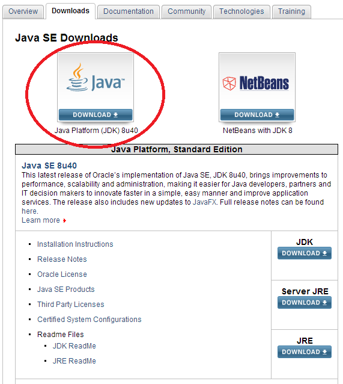
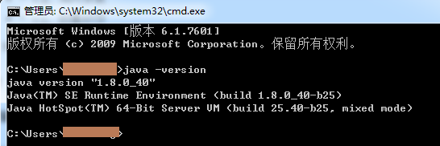
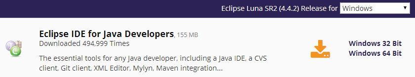
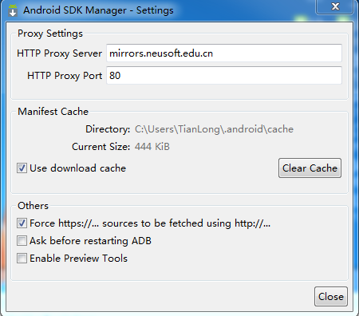
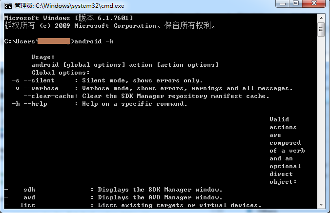

Android环境搭建---待续
====

##软件下载

1. [**JDK安装**](http://www.oracle.com/technetwork/java/javase/downloads/index.html)
2. [**Eclipse安装**](http://www.eclipse.org/downloads/)
3. [**Android SDK安装**](http://pan.baidu.com/s/1c0vnzMC)
4. [**Eclipse ADT安装**](http://www.oschina.net/question/1463998_220998) : <http://yunpan.cn/cy8GDAzeeFgji>（提取码：8280）

##**下载及安装说明：**
---
1. 下载最新JDK：

设置环境变量步骤：
```
我的电脑->属性->高级->环境变量->系统变量中添加以下环境变量：
JAVA_HOME值为： D:\Program Files\Java\jdk1.6.0_18（你安装JDK的目录）
CLASSPATH值为：.;%JAVA_HOME%\lib\tools.jar;%JAVA_HOME%\lib\dt.jar;%JAVA_HOME%\bin;
Path:  在开始追加 %JAVA_HOME%\bin;
```
检查JDK是否安装成功。打开cmd窗口，输入java –version 查看JDK的版本信息。出现类似下面的画面表示安装成功了：


2. 下载最新**Eclipse**,解压之后即可使用。


3. 下载**Android SDK**：
    - 运行**SDK Manager.exe**选择要下载的包，进行更新。由于默认情况下，google的域名被墙了，所以可能下载不下来。因此要使用镜像的方式。这里使用“大连东软信息学院镜像服务器地址”：
    - 打开 SDK Manager --> Tools --> Options ;
    - 在 Proxy Settings 设置里，填写：
    ```
    Http Proxy Server : mirrors.neusoft.edu.cn
    Http Proxy Port   : 80
    ```
    - 同时选中 Others 的第一个选项：
    ```
    Force http://... sources to be fetched using http://...
    ```
    - 其他默认，如图：
    
    - 要经过很长的时间，下载好后在系统变量中Path值后添加：
    ```
    D:\API\Android\android-sdk-windows\tools;
    ```
    - 最后，重启计算机，进入cmd命令窗口，检查SDK是不是安装成功。
    - 运行 `android –h` 如果有类似以下的输出，表明安装成功：
    

4. Eclipse ADT 安装
    - 打开 Eclipse IDE，进入菜单中的 Help -->  Install New Software
    - 点击Add...按钮，弹出对话框要求输入Name和Location：Name自己随便取，Location输入<http://dl-ssl.google.com/android/eclipse>。
    - 由于 google 被墙的缘故， 可以到<http://www.androiddevtools.cn/>下载最新版ADT。下载好后，通过 **Location** 选取解压后的ADT文件夹，进行安装。  

##**AVD** 创建
1. 在Eclipse中。选择Windows > Android SDK and AVD Manager
2. 点击 Create 创建一个，参数可以自己设定。

## 最后使用 Eclipse 创建一个 “HelloWorld" 吧
