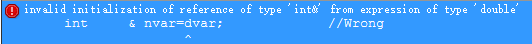

[**GitHubBlog**](https://github.com/bbxytl/bbxytl.github.com/tree/master/blog#home--githubblog) /
=====

##[**C++学习之引用**](https://github.com/bbxytl/bbxytl.github.com/blob/master/blog/pages/2_C++学习之引用.md#githubblog-)

##1. 引用的定义及意义
###a. 引用的定义
引用必须初始化。因为引用一经定义，它就不能再指向其他对象了，所以需要进行初始化。
```cpp
type & quote_name=var_name;
```
但引用不能用引用对象的地址进行初始化。如果想对对象的地址进行引用，可以定义一个指针引用。
###b. 引用的意义
```cpp
int a=10;
int &b=a;
```
这里，**b**就是一个引用，**b**实际上指向的是**a**的地址，但它不是指针，是引用，是**a**的别名，**a**能做的**b**都能做。

##2. 引用的应用
实际应用中，引用主要被用来作为函数的形式参数。
引用在内部存放的是一个对象的地址，它是该对象的别名。对于不可寻址的值，如字符串常量，以及不同类型的对象，编译器为了实现引用，必须生成一个临时对象，引用实际上指向该对象，但用户不能访问它。这时当引用用来作为函数形参时就引入了**const**引用问题。
##3. const 引用问题
- const 引用可以用不同的类型对象初始化（只要类型之间可以默认转换即可），也可以是不可寻址的值，如字符串常量。非const 引用不行。

```cpp
double  dvar=2.12;
int     & nvar=dvar;             //Wrong
int     const& cnvar=dvar;       //OK
double  & cdqvar=dvar+1.0;      //Wrong
double  const& cdqvar=dvar+1.0;  //OK
```

- 编译器在处理引用时，会将其转换如下，生成一个临时对象。

```cpp
double  dvar=2.12;
int     const& cnvar=dvar;
///编译器转换--Beg
int     tmp=dvar;           //double -> int
int     const& cnvar=tmp; 
///End
```
- 不允许非const引用指向需要临时对象的对象或值，即，编译器产生临时变量的时候引用必须为const 。

```cpp
int nvar=100;
int * &pqvar=&nvar;      //Wrong , &nvar 产生了一个临时的对象，引用必须为const
int * const & pcqvar=&nvar; //OK

int const nvar0=100;
int * &pqref=&nvar0;    //Wrong, 非const引用是非法的
int const * &pcqref=&nvar0; //Wrong, 需要临时变量，且因为nvar0是一个常量，所以需要一个常量指针，以确保不能修改nvar0的值，而pcqref是一个非常量指针
int const * const &cpcqref=&nvar0; //OK
int const *p = &nvar0;
int const * &ref = p;  //OK
```
>注：常量指针和指针常量
```
int a；
int * const p = &a    //指针常量，*p可以修改：*p = 8；（OK）
                      //p不可以修改： p++；（ERROR）
int a，b；
const int *p = &a；   //常量指针，*p不可修改：*p = 8；（ERROR）
                      //p 可以修改： p = &b  （OK）
```

总结：
- 不允许非**const**引用指向需要临时对象的对象或值
- 地址值是不可寻址的值
- const引用表示，试图通过此引用去（间接）改变其引用的对象的值时，编译器会报错。这并不意味着原来的对象也变成const类型了，我们仍然可以通过原对象来更改对象的值，达到更改引用对象的值的目的。

```cpp
int nvar=100;
int const &ref=nvar;
nvar++;     //OK
//ref++;    //Wrong
cout<<nvar<<endl<<ref<<endl;
///输出：
101
101
```


##**附录**
- **[GitHub-LeetCodesOJ](https://github.com/bbxytl/LeetCodesOJ/blob/master/README.md#githubblog--leetcodesoj)** 
- **[GitHub-Blog](http://bbxytl.github.io/)**