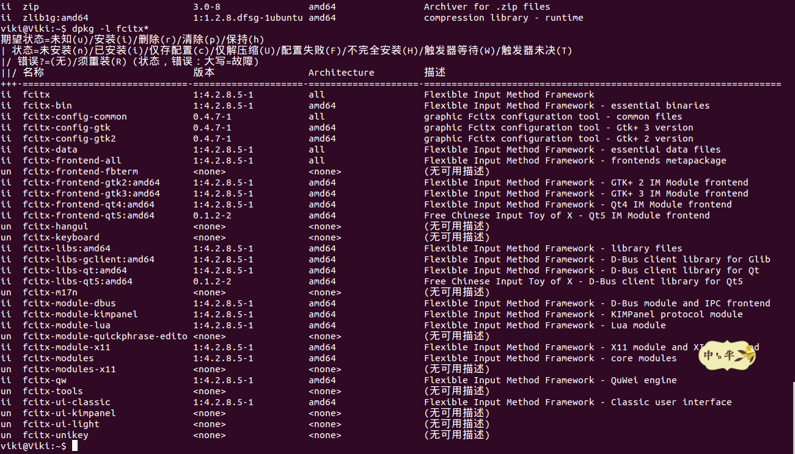
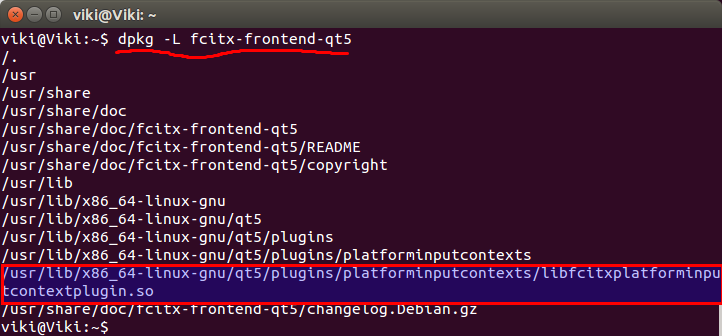
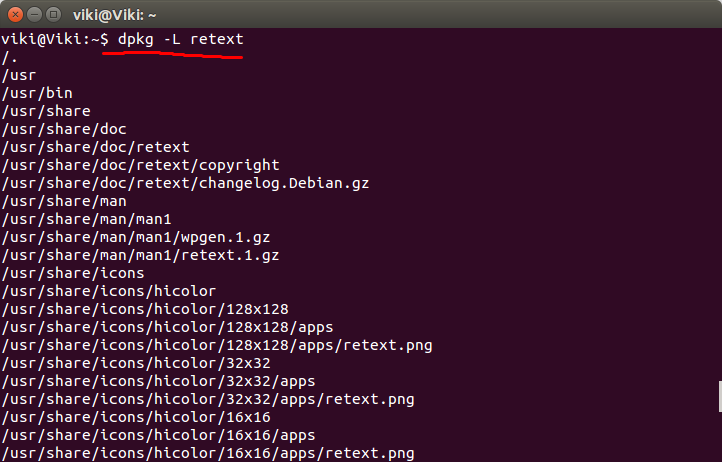
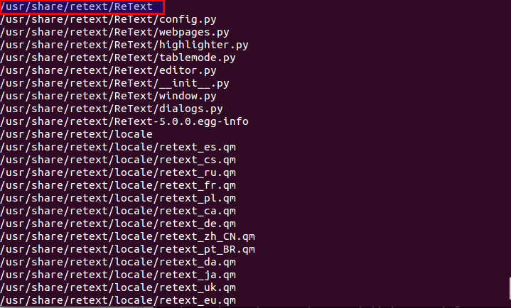

[**GitHubBlog**](https://github.com/bbxytl/bbxytl.github.com/tree/master/blog#home--githubblog) /
=====
#[**Ubuntu下Qt（Retex）无法输入中文**](https://github.com/bbxytl/bbxytl.github.com/blob/master/blog/pages/3_Ubuntu下Qt（Retex）无法输入中文.md#githubblog-)
----
这个问题从我第一次在Ubuntu上使用Qt便困扰着我，奈何之前一直没认真去解决掉这个问题。今天作死想想，这个不可能解决不掉的。因为那么多人用Ubuntu，而且又那么多人用Qt的产品，比如Retext。不可能都不能用中文吧，按照这个思路，我决定把这个问题搞清除。   

网上有一份教程（应该说是很多份相同的教程，严重怀疑事不经认证的copy），如：<http://www.th7.cn/system/lin/201407/63590.shtml>
我不清楚这份教程是适合那个版本的Ubuntu，但对我来说，那是一个不管用啊。坑的我来回卸载安装重启。最后还是不能用。

我的系统刚安装没多久，版本号：Ubuntu14.10，Qt5.3.1。按理说我没安装一些乱七八糟的东西，库应该不会有问题的啊，而且输入法是严格按照**搜狗输入法**官网的方法安装的，自动安装了fcitx。
检查一下系统安装的 fcitx系列包：

```shell
~$: dpkg -l fcitx*
```
结果显示如下：


其中，有一项：**fcitx-frontend-qt5** 是后来通过命令安装的。这个包也是Qt项目能在Ubuntu下输入中文的关键项目。

网上和Qt的QQ群里找了一下资料发现需要安装**fcitx-frontend-qt5** ，所以手动安装了一下，但发现系统中已经有了，所以应该不是这个问题。（我之前参照安装**ibus-qt4**的方式安装了一下**fcitx\*qt\***）shell命令如下：   

```shell
~$: sudo apt-get install fcitx*qt*
```
但这种方式其实并没有解决问题，也不管用。
最后急了，想是后是因为Qt找不到库文件呢，在QQ群里也得到了印证，所以尝试将**fcitx-frontend-qt5**输入法部分复制到Qt中：(我的Qt安装目录是：/home/myname/Qt5.3.1/)
首先找到**fcitx-frontend-qt5**的库的安装位置：`~$: dpkg -L fcitx-frontend-qt5`


```shell
~$: sudo apt-get install fcitx-frontend-qt5
~$: sudo cp /usr/lib/x86_64-linux-gnu/qt5/plugins/platforminputcontexts/libfcitxplatforminputcontextplugin.so  /home/myname/Qt5.3.1/5.3/gcc_64/plugins/platforminputcontexts
~$: sudo cp /usr/lib/x86_64-linux-gnu/qt5/plugins/platforminputcontexts/libfcitxplatforminputcontextplugin.so  /home/myname/Qt5.3.1/Tools/QtCreator/bin/plugins/platforminputcontexts/
```
然后再次重启QtCreator，O，GOD ！还是不可以用了～～～～～但发现状态栏输入法部分有问题，遂更改之：输入法选择：搜狗输入法，文本输入选择**En**或**Zh**，不是**pinyin**，再在QtCreator里测试了一下，呵呵，解决了～_~ 。

我装了**markdown**编辑器**Retext**，同样也是不能输入中文，由于**Retext**也是基于**Qt**库，所以我想能不能也用此种方法解决呢。先查看**Retext**安装目录（我是使用终端进行安装的`~$: sudo apt-get install retext`）:
首先找**Retext**安装位置：`~$: dpkg -l retext`


可以看到，基本是在目录：**/usr/share/retext/**，而且没找到**plugins**这样的目录，那我们就先测试一下copy到根下能不能用吧：

```shell
~$: sudo cp /usr/lib/x86_64-linux-gnu/qt5/plugins/platforminputcontexts/libfcitxplatforminputcontextplugin.so  /usr/share/retext
```
复制后，打开**Retext**测试一下，发现，呵呵，能用中文了～～～～OY ！
此文档便是使用其进行编写的！
至此，猜想，以后如果再遇到这种不能输入中文的问题，就将**fcitx-frontend-qt5**copy到程序目录下看看～～～想来其他的应该也是这样。由于网上的关于这方面的教程本人实测后都没有效果，所以将此方法记录下来，给还没有解决的人一个参照。

最后，在QQ群里，有人向我推荐了一个博文：<http://blog.csdn.net/crazyboy2009/article/details/38537099>，后来看看，好吧，看来我得改进改进搜索方式了～～。看到有网友回复不能用，好像是因为：复制时要更改文件权限 shmod a+x。我的并没有出现这个问题，如果不能用，试一下改改权限。


##**附录**
- **[GitHub-Blog](http://bbxytl.github.io/)**
- **关注微信订阅号**：     
    
