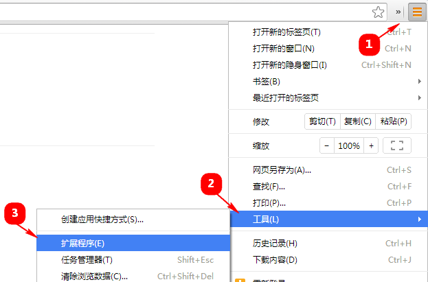
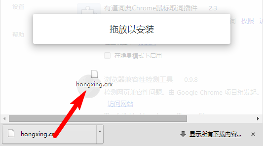
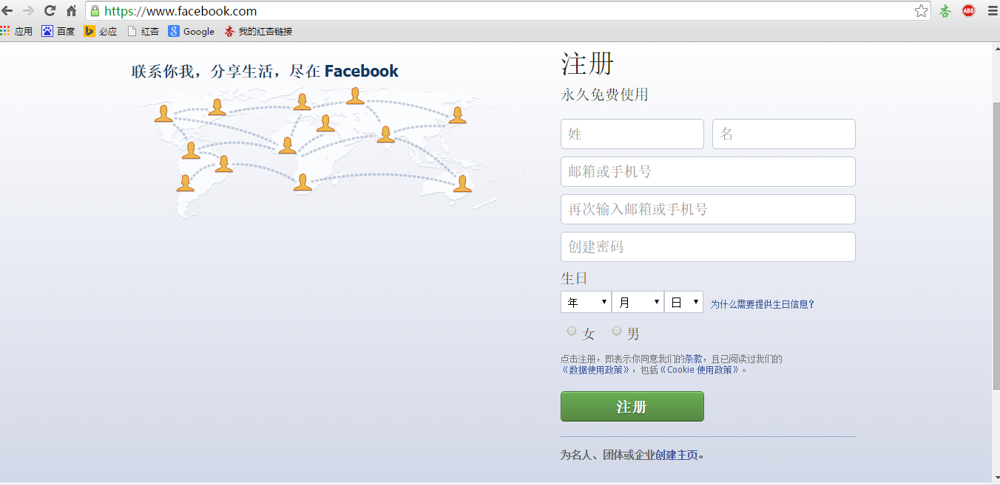

[**GitHubBlog**](https://github.com/bbxytl/bbxytl.github.com/tree/master/blog#home--githubblog) /
=====
#[最简单**翻墙软件** Chrome插件及教程](https://github.com/bbxytl/bbxytl.github.com/blob/master/blog/pages/4_最简单翻墙软件-Chrome插件及教程.md#githubblog-)

- 这里介绍的是一款Chrome的插件：**红杏**，由于正常情况下无法登陆谷歌浏览器的应用商店下载这个插件，所以这里提供一个下载链接，按照以下教程安装后即可。红杏使用的是邀请制，下载链接下是邀请链接。
- 在后面，为证实可用，我贴了几个比较出名的网站的截屏。
##1、下载chrome扩展包
[**下载红杏离线包**](http://honx.in/i/VSkoq4kWGhjEC7Co)  
<http://honx.in/i/VSkoq4kWGhjEC7Co>

##2、打开浏览器的【扩展程序页】

##3、把下载的扩展包（hongxing.crx）拖拽到【扩展程序页】（只能是这个页面）

##4、安装成功

安装成功之后，插件将会随新版本的发布而自动更新。
为了将来也能顺利安装，请将本页面加入到收藏夹（按Ctrl+D）

##5、安装后实测图
- **facebook**
	
- **twitter**
	
- **youtube**
	

###**还等什么，感觉试试吧！**
[**下载红杏离线包**](http://honx.in/i/VSkoq4kWGhjEC7Co)  
<http://honx.in/i/VSkoq4kWGhjEC7Co>

##**附录**
- **[GitHub-Blog](http://bbxytl.github.io/)**
- **关注微信订阅号**：     
    
